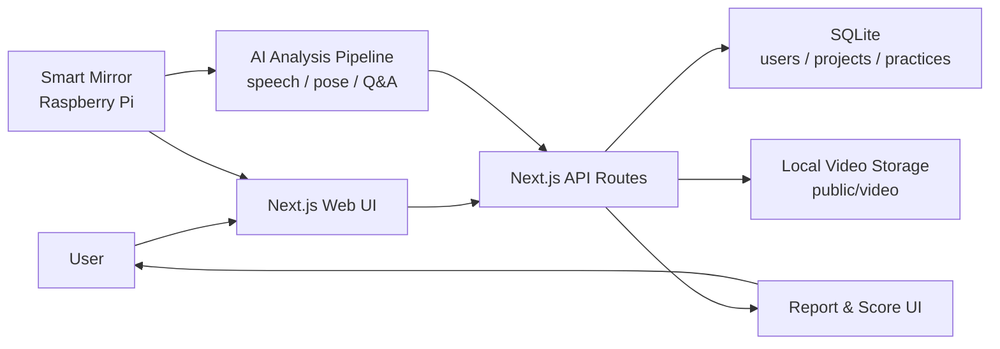

# PLAVO

발표 연습을 프로젝트 단위로 기록하고, 영상과 분석 결과를 리포트로 확인하는 발표 피드백 서비스입니다. 사용자는 발표 목표를 등록하고 연습 영상을 저장한 뒤, 발표 속도·발음·자세·Q&A 항목별 피드백을 확인할 수 있습니다.

현재 저장소는 Next.js 웹 클라이언트, API Routes, SQLite 저장소, 영상 업로드, 리포트 UI를 중심으로 구성되어 있습니다. Raspberry Pi 기반 스마트 미러와 AI 분석 모델은 외부 연동 대상으로 설계했습니다.

## Overview

- 발표 프로젝트 생성, 목표 시간 설정, 연습 기록 관리
- 발표 영상 업로드 및 연습 단위 저장
- 속도, 발음, 자세, Q&A 기준의 피드백 리포트 UI
- 점수와 분석 결과를 카드와 차트로 확인하는 대시보드
- 스마트 미러와 분석 파이프라인 연동을 고려한 API 중심 구조

## Role

- Next.js 기반 프론트엔드 화면, 라우팅, 상태 처리 구현
- 인증, 프로젝트, 연습 기록, 영상 업로드 API 설계 및 구현
- 사용자, 프로젝트, 연습 기록 중심의 데이터 모델링
- 발표 점수, 항목별 피드백, 리포트 화면, 성장 지표 UI 구성
- 발표 연습 생성부터 분석 결과 확인까지 이어지는 사용자 흐름 설계

## Tech Stack

| 영역 | 기술 |
| --- | --- |
| Frontend | Next.js 14, React, TypeScript, Tailwind CSS |
| UI | Radix UI, lucide-react, Recharts |
| Backend | Next.js Route Handlers, REST API |
| Database | SQLite, better-sqlite3 |
| Storage | Local file upload, public video serving |
| External Integration | Raspberry Pi 기반 스마트 미러, AI 분석 모델 연동 구조 |

## Features

- 사용자 회원가입 및 로그인
- 발표 프로젝트 생성, 상세 조회, 진행 중인 프로젝트 조회
- 프로젝트별 연습 기록 생성 및 조회
- 발표 영상 업로드와 로컬 저장
- 발표 속도, 발음, 자세, Q&A 리포트 화면
- 발표 점수와 분석 결과 시각화
- 프로젝트/연습 단위 REST API

## Architecture



## Data Model

- `users`: 사용자 계정 정보
- `projects`: 발표 프로젝트 정보, 목표 시간, 마감일, 생성일
- `practices`: 프로젝트별 발표 연습 기록, 연습 유형, 발표 시간, 영상 URL

## Highlights

- Next.js App Router와 Route Handlers를 함께 사용해 웹 화면과 API 서버를 한 저장소에서 관리
- 프로젝트 생성, 연습 생성, 영상 업로드, 리포트 확인으로 이어지는 핵심 플로우 구성
- 사용자/프로젝트/연습 기록을 분리한 데이터 모델로 발표 기록 누적 관리
- 점수 중심 화면이 아니라 항목별 피드백을 확인하는 리포트형 UI 구성
- Recharts 기반 차트와 카드 UI로 발표 결과를 빠르게 훑을 수 있는 화면 설계

## Getting Started

```bash
cp .env.example .env.local
npm install
npm run dev
```

`JWT_SECRET`에는 로컬에서 사용할 32자 이상의 임의 문자열을 설정합니다.

개발 서버 실행 후 브라우저에서 `http://localhost:3000`으로 접속합니다.
